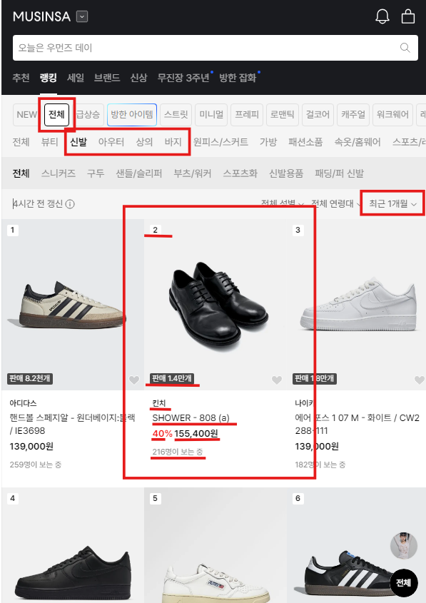
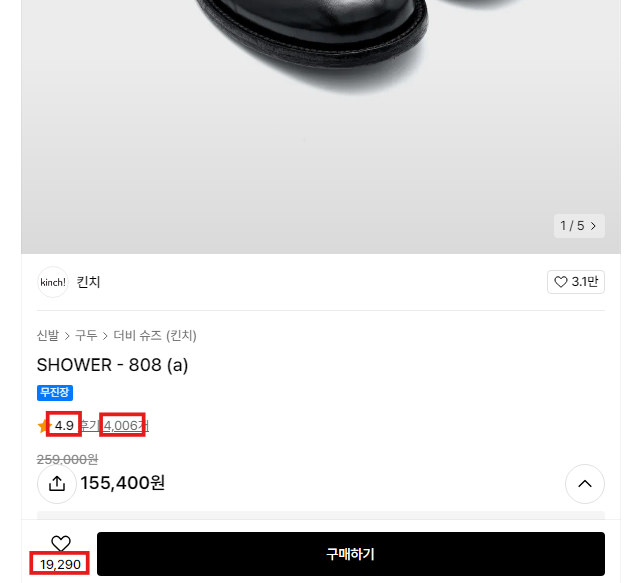
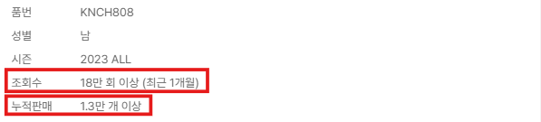

## CSV 파일

###  **`ranking-{category}-summary.csv`**: 랭킹 데이터

- 무신사 랭킹에서 "전체"카테고리 선택 후, 그 중에서 "신발", "아우터", "상의", "하의"에서만 데이터 수집
-  랭킹 기간 범위는 "최근 1개월"로 설정
- 각 랭킹 상품에서 아래 컬럼에 맞는 데이터를 가져옴
- `productId`는 이미지에 안 보이지만, 요소에서 가져옴

- 컬럼:
  - `productId(PK)`
  - `date(PK)`: yyyymmddHH 형식으로 저장
  - `brandName`
  - `productName`
  - `price`
  - `discountRate`
  - `currentlyViewing`
  - `currentlyBuying`
  - `ranking`
  - `trending`
  - `totalSales`
  - `colors`
  - `category`
###  **`detail-{category}.csv`**: 랭킹 데이터에 있는 각 상품의 세부 정보

- `ranking-{category}-summary.csv`에서 수집한 `productId`를 이용하여 각 상품의 상세 페이지로 이동
- 각 상세 페이지에서 아래 컬럼에 맞는 데이터를 가져옴

- 컬럼:
  - `productId(PK)`
  - `date(PK)`: yyyymmddHH 형식으로 저장
  - `views`
  - `likes`
  - `rating`
  - `ratingCount`
